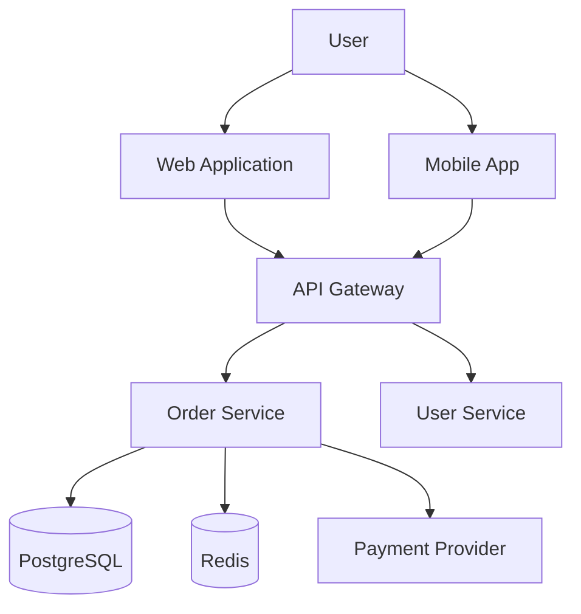
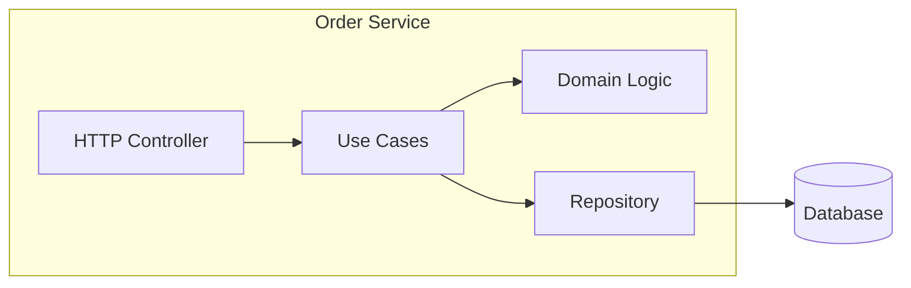
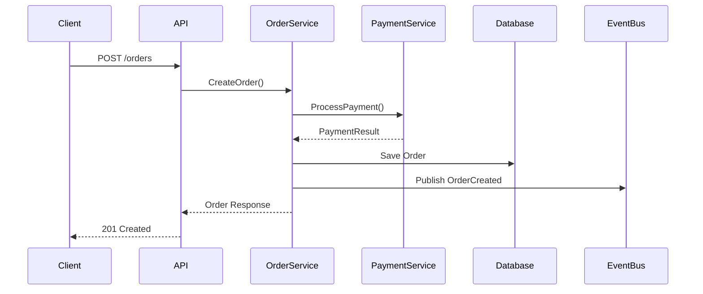

# Architecture - Design Review Workflow

Systematic architecture review that ensures proper design before code implementation.

## Core Philosophy

**Architecture Review is NOT:**
- Jumping straight to code
- "Let's figure it out as we go"
- Local optimizations without global view
- Implementing without considering alternatives

**Architecture Review IS:**
- Design first, code second
- Trade-off analysis before decisions
- Clear boundaries and responsibilities
- Approval gate before implementation

## The Architecture Mindset

```
┌─────────────────────────────────────────────────────────┐
│               ARCHITECTURE FIRST                         │
├─────────────────────────────────────────────────────────┤
│  BAD:  "Let me write the code and we'll see"            │
│  GOOD: "Let me design the structure, review options,    │
│         get approval, then implement"                   │
├─────────────────────────────────────────────────────────┤
│  BAD:  "Just add this to the existing controller"       │
│  GOOD: "Does this belong here? What's the right layer?  │
│         How does it fit the overall architecture?"      │
└─────────────────────────────────────────────────────────┘
```

## Mandatory Workflow (6 Steps)

### Step 1: REQUIREMENTS - Understand the Full Scope

**Before ANY design, clarify requirements:**

```
<requirements>
## Functional Requirements
1. [What the system must do]
2. [Core features]
3. [User interactions]

## Non-Functional Requirements (NFRs)
| Category | Requirement | Target |
|----------|-------------|--------|
| Performance | Response time | < 200ms p95 |
| Scale | Concurrent users | 10,000 |
| Availability | Uptime | 99.9% |
| Security | Authentication | OAuth2 + JWT |
| Data | Retention | 7 years |
| Compliance | Standards | GDPR, SOC2 |

## Constraints
- Tech stack: [must use X, cannot use Y]
- Timeline: [deadline]
- Team: [size, expertise]
- Budget: [infrastructure limits]

## Out of Scope
- [What we're NOT building]
</requirements>
```

**If requirements are unclear, ASK:**
- What's the expected scale (users, data, traffic)?
- What are the performance requirements?
- What security/compliance constraints exist?
- What's the team's expertise?
- What existing systems must this integrate with?

### Step 2: HIGH-LEVEL DESIGN - Architecture Overview

**Design the overall structure:**

```
<high_level_design>
## Architecture Style
[Monolith / Microservices / Serverless / Event-Driven / Hybrid]

Rationale: [Why this style fits the requirements]

## Layer Structure
```
┌─────────────────────────────────────┐
│         Presentation Layer          │
│   (API Gateway, Controllers, UI)    │
├─────────────────────────────────────┤
│         Application Layer           │
│   (Use Cases, Orchestration)        │
├─────────────────────────────────────┤
│           Domain Layer              │
│   (Business Logic, Entities)        │
├─────────────────────────────────────┤
│        Infrastructure Layer         │
│   (DB, Cache, External APIs)        │
└─────────────────────────────────────┘
```

## Core Components
| Component | Responsibility | Technology |
|-----------|---------------|------------|
| API Gateway | Request routing, auth | Kong/Nginx |
| Order Service | Order management | Go + PostgreSQL |
| Payment Service | Payment processing | Go + Stripe |
| Notification | Alerts, emails | Go + Redis + SendGrid |

## Key Interfaces
```go
// Order Service Interface
type OrderService interface {
    CreateOrder(ctx context.Context, req CreateOrderRequest) (*Order, error)
    GetOrder(ctx context.Context, id string) (*Order, error)
    CancelOrder(ctx context.Context, id string) error
}
```

## Data Flow
[Request] → [Gateway] → [Service] → [Domain] → [Repository] → [Database]
                                  ↓
                            [Event Bus] → [Subscribers]
</high_level_design>
```

### Step 3: DIAGRAM - Visual Architecture

**Provide visual representation:**

```
<diagram>
## System Context (C4 Level 1)


## Component Diagram (C4 Level 2)


## Sequence Diagram

</diagram>
```

### Step 4: ALTERNATIVES - Trade-off Analysis

**Always consider alternatives:**

```
<alternatives>
## Option A: Monolithic Architecture

### Description
Single deployable unit with all functionality.

### Pros
- Simple deployment and operations
- Easy local development
- No network latency between components
- Simpler transactions

### Cons
- Harder to scale individual components
- Single point of failure
- Longer deployment cycles
- Team coupling

### Best For
- Small teams (< 10 developers)
- Early-stage products
- Simple domains

---

## Option B: Microservices Architecture

### Description
Separate services per domain, independent deployment.

### Pros
- Independent scaling
- Technology flexibility
- Team autonomy
- Fault isolation

### Cons
- Operational complexity
- Network latency
- Distributed transactions
- Debugging difficulty

### Best For
- Large teams
- Complex domains
- High scale requirements

---

## Option C: Modular Monolith

### Description
Single deployment with clear module boundaries, can evolve to microservices.

### Pros
- Simple operations like monolith
- Clear boundaries like microservices
- Easy to extract services later
- Best of both worlds

### Cons
- Requires discipline to maintain boundaries
- Still single deployment unit
- Shared database

### Best For
- Medium teams
- Growing products
- Uncertain scale requirements

---

## Comparison Matrix

| Criteria | Monolith | Microservices | Modular Monolith |
|----------|----------|---------------|------------------|
| Complexity | Low | High | Medium |
| Scalability | Low | High | Medium |
| Team Size | Small | Large | Medium |
| Time to Market | Fast | Slow | Fast |
| Operational Cost | Low | High | Low |
</alternatives>
```

### Step 5: RECOMMENDATION - Justified Decision

**Make a clear recommendation:**

```
<recommended>
## Recommended Approach: [Option Name]

### Decision
Based on the requirements analysis, I recommend **Modular Monolith** architecture.

### Justification

| Factor | Analysis |
|--------|----------|
| Team Size | 5 developers → Monolith pattern manageable |
| Scale | 10K users → Monolith sufficient for now |
| Timeline | 3 months → Simple architecture faster |
| Future | Clear modules enable future extraction |

### Key Design Decisions

1. **Layered Architecture**
   - Why: Clear separation of concerns, testability
   - Trade-off: More boilerplate vs maintainability

2. **Domain-Driven Design**
   - Why: Complex business rules, bounded contexts
   - Trade-off: Learning curve vs long-term clarity

3. **Event-Driven Communication**
   - Why: Loose coupling between modules
   - Trade-off: Eventual consistency vs decoupling

4. **Repository Pattern**
   - Why: Database abstraction, testability
   - Trade-off: Extra layer vs flexibility

### Technology Choices

| Component | Choice | Rationale |
|-----------|--------|-----------|
| Language | Go | Team expertise, performance |
| Database | PostgreSQL | ACID, JSON support, mature |
| Cache | Redis | Fast, pub/sub capability |
| Queue | Redis Streams | Simple, already using Redis |
| API | REST + gRPC | REST for external, gRPC internal |
</recommended>
```

### Step 6: RISKS - Identify and Mitigate

**Document risks and mitigations:**

```
<risks>
## Technical Risks

### Risk 1: Database Bottleneck
- **Probability**: Medium
- **Impact**: High
- **Mitigation**:
  - Read replicas for queries
  - Caching layer (Redis)
  - Connection pooling
  - Query optimization

### Risk 2: Module Coupling
- **Probability**: High (without discipline)
- **Impact**: Medium
- **Mitigation**:
  - Enforce boundaries via linting
  - Code review checklist
  - Interface-based communication
  - Regular architecture reviews

### Risk 3: Single Point of Failure
- **Probability**: Low
- **Impact**: High
- **Mitigation**:
  - Multiple instances behind load balancer
  - Health checks and auto-restart
  - Database failover
  - Monitoring and alerting

## Operational Risks

### Risk 4: Deployment Downtime
- **Probability**: Medium
- **Impact**: Medium
- **Mitigation**:
  - Rolling deployments
  - Database migrations as separate step
  - Feature flags for gradual rollout
  - Rollback procedures

## Risk Matrix

| Risk | Probability | Impact | Priority |
|------|-------------|--------|----------|
| DB Bottleneck | Medium | High | High |
| Module Coupling | High | Medium | High |
| Single Point of Failure | Low | High | Medium |
| Deployment Downtime | Medium | Medium | Medium |
</risks>
```

### Step 7: NEXT STEPS - Path Forward

**Define clear next steps:**

```
<next_steps>
## Approval Required
- [ ] Architecture design approved by [stakeholder]
- [ ] Technology choices confirmed
- [ ] Risk mitigations accepted

## Implementation Phases

### Phase 1: Foundation (Week 1-2)
- Set up project structure
- Implement core domain models
- Database schema and migrations
- Basic API scaffolding

### Phase 2: Core Features (Week 3-6)
- Order management module
- User management module
- Payment integration
- Event system

### Phase 3: Polish (Week 7-8)
- Error handling and logging
- Monitoring and metrics
- Performance optimization
- Documentation

## Questions for Review
- Does this architecture meet your requirements?
- Are there constraints I should consider?
- Should we proceed with implementation?
</next_steps>
```

## Output Format Template

Every architecture response MUST use this structure:

```markdown
<requirements>
[Functional + Non-functional + Constraints]
</requirements>

<high_level_design>
[Architecture style, layers, components, interfaces]
</high_level_design>

<diagram>
[Mermaid/PlantUML diagrams]
</diagram>

<alternatives>
[2-3 options with trade-offs]
</alternatives>

<recommended>
[Chosen approach with justification]
</recommended>

<risks>
[Identified risks with mitigations]
</risks>

<next_steps>
[Approval gate + implementation phases]
</next_steps>
```

## Design Principles Reference

### SOLID Principles

| Principle | Meaning | Application |
|-----------|---------|-------------|
| **S**ingle Responsibility | One reason to change | One module = one responsibility |
| **O**pen/Closed | Open for extension, closed for modification | Use interfaces, strategy pattern |
| **L**iskov Substitution | Subtypes must be substitutable | Proper inheritance, contracts |
| **I**nterface Segregation | Many specific interfaces | Small, focused interfaces |
| **D**ependency Inversion | Depend on abstractions | High-level defines interfaces |

### Clean Architecture Layers

```
┌────────────────────────────────────────┐
│           External Interfaces          │
│    (Controllers, Presenters, Gateways) │
├────────────────────────────────────────┤
│           Interface Adapters           │
│    (Repository Impl, API Clients)      │
├────────────────────────────────────────┤
│            Application Layer           │
│    (Use Cases, Application Services)   │
├────────────────────────────────────────┤
│              Domain Layer              │
│    (Entities, Value Objects, Rules)    │
└────────────────────────────────────────┘

Dependency Rule: Dependencies point INWARD only
```

### Common Patterns

| Pattern | When to Use |
|---------|-------------|
| Repository | Abstract data access |
| Factory | Complex object creation |
| Strategy | Interchangeable algorithms |
| Observer/Event | Loose coupling between components |
| Adapter | Integrate external systems |
| Facade | Simplify complex subsystems |
| CQRS | Separate read/write models |
| Saga | Distributed transactions |

## Integration with CLAUDE.md Rules

This skill enforces project architecture standards:

| CLAUDE.md Rule | Architecture Enforcement |
|----------------|-------------------------|
| SOLID (SRP priority) | Layer and component design |
| Abstract first | Interfaces before implementation |
| Explicit errors | Error handling in design |
| No hardcoded fallbacks | Configuration in design |

## Anti-Patterns (NEVER DO)

1. **DO NOT** jump straight to code without design
2. **DO NOT** ignore non-functional requirements
3. **DO NOT** present only one option without alternatives
4. **DO NOT** skip the approval gate
5. **DO NOT** create circular dependencies
6. **DO NOT** put business logic in controllers
7. **DO NOT** hardcode external service details
8. **DO NOT** ignore scalability concerns
9. **DO NOT** forget operational requirements
10. **DO NOT** design without considering the team's expertise
