# Architecture Diagram Templates

Ready-to-use Mermaid diagram templates for architecture documentation.

## C4 Model Diagrams

### Level 1: System Context

Shows system and external actors/systems.

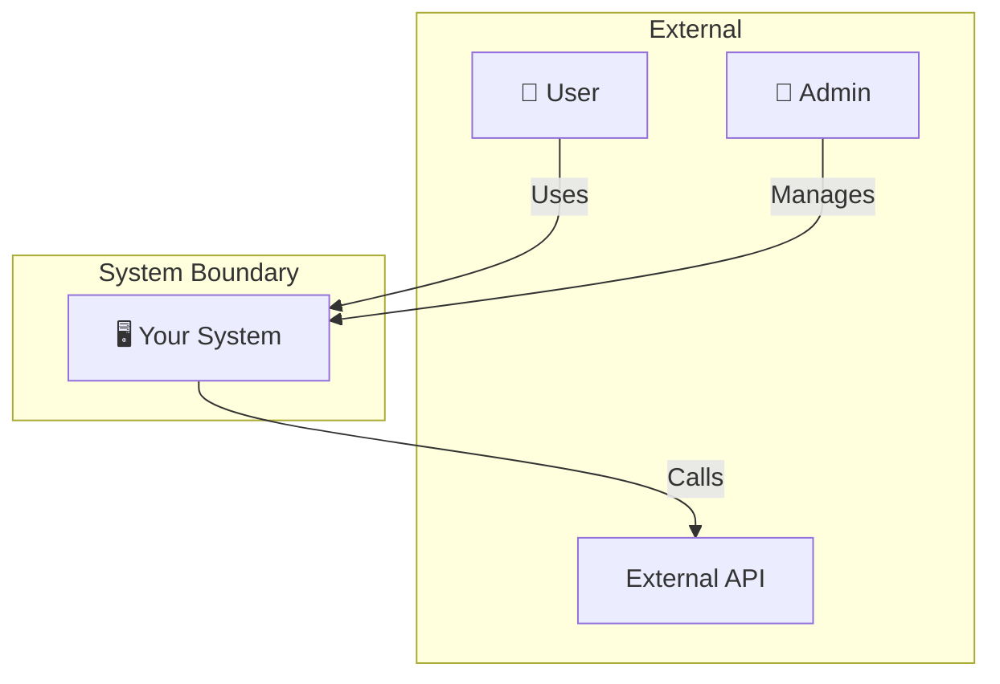

**Template:**
```
graph TB
    subgraph External
        Actor1[👤 Actor Name]
        ExtSystem[External System]
    end

    subgraph "System Boundary"
        System[🖥️ System Name]
    end

    Actor1 -->|Action| System
    System -->|Action| ExtSystem
```

---

### Level 2: Container Diagram

Shows deployable units within the system.

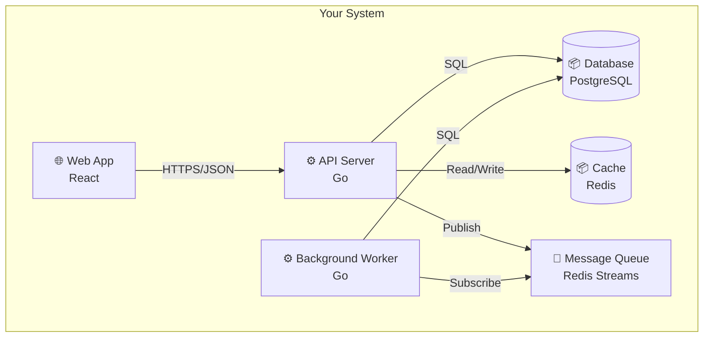

---

### Level 3: Component Diagram

Shows components within a container.

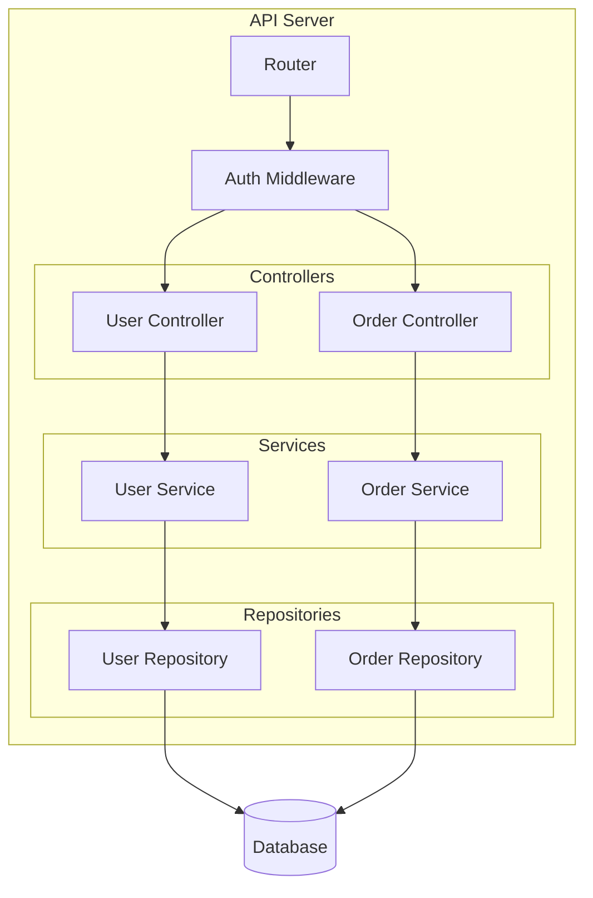

---

## Sequence Diagrams

### Basic Request Flow

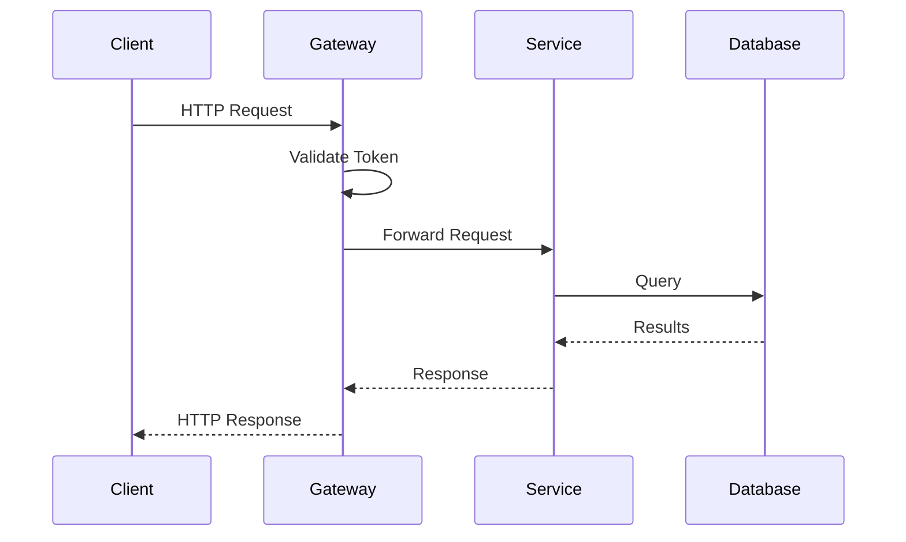

### With Error Handling

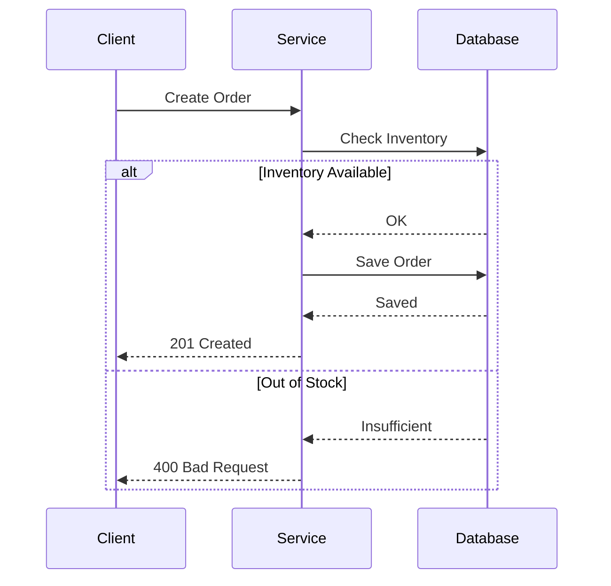

### Async with Events

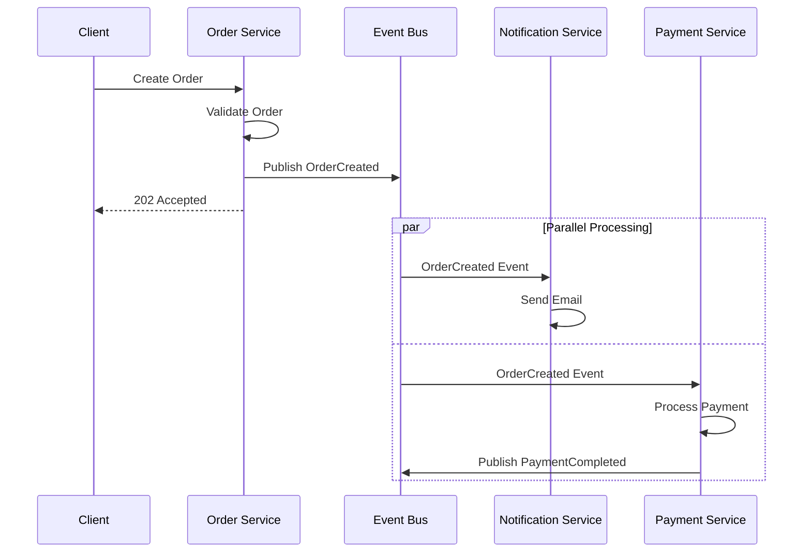

---

## Data Flow Diagrams

### Simple Flow

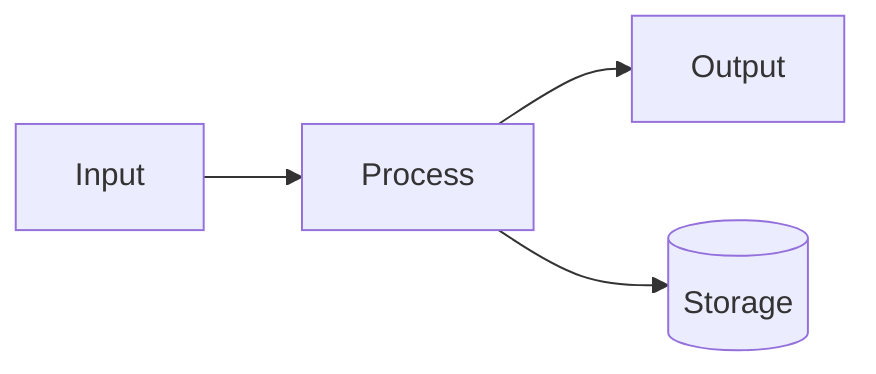

### Complex Flow with Decisions

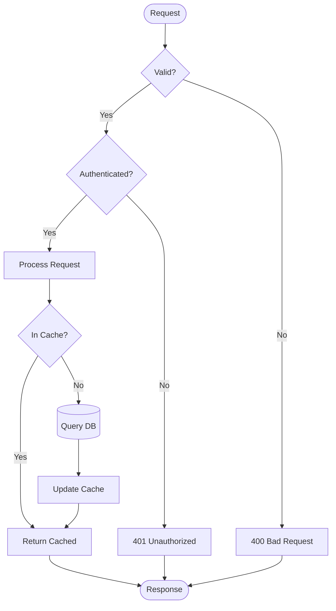

---

## State Diagrams

### Order State Machine

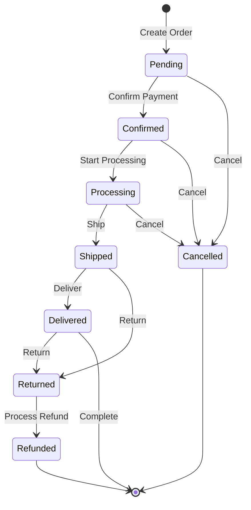

---

## Entity Relationship Diagrams

### Basic ERD

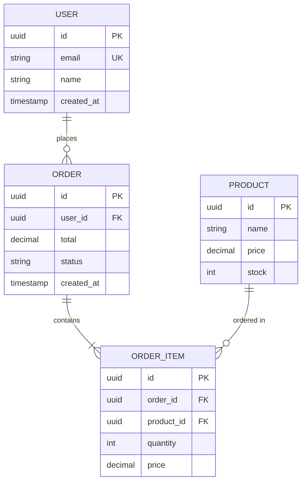

### Multi-Tenant ERD

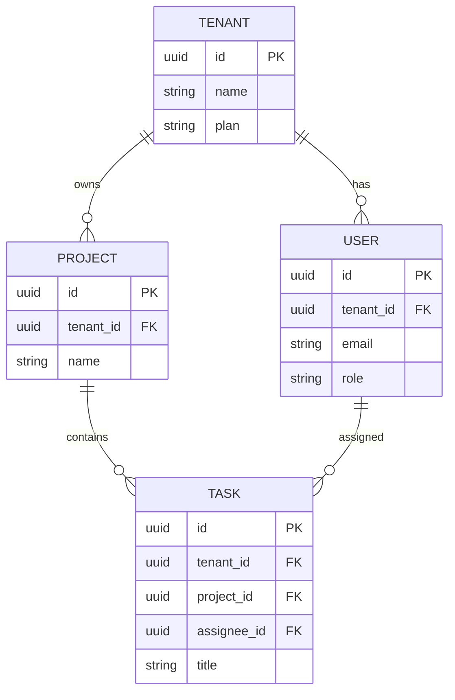

---

## Deployment Diagrams

### Kubernetes Deployment

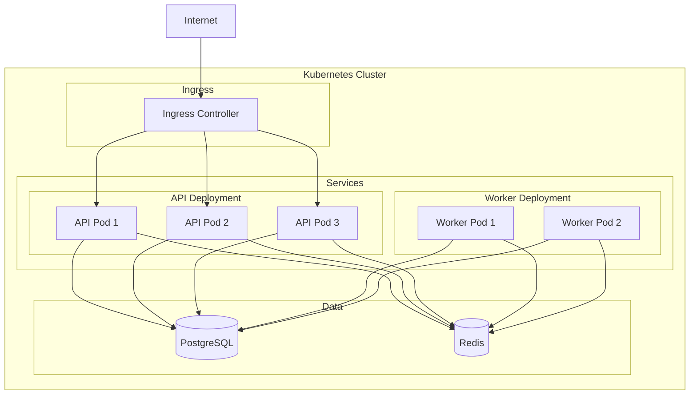

### Cloud Architecture

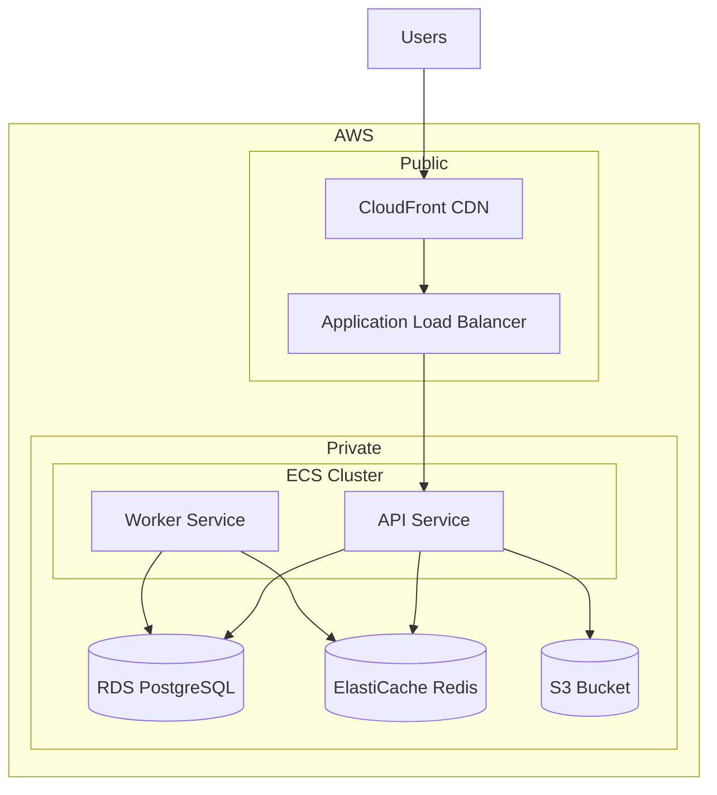

---

## Microservices Diagrams

### Service Communication

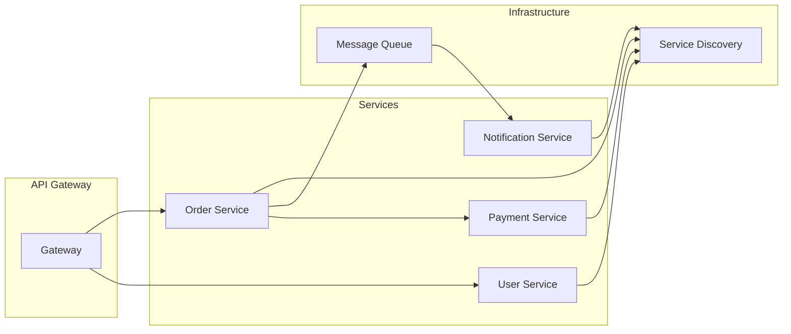

### Event-Driven Services

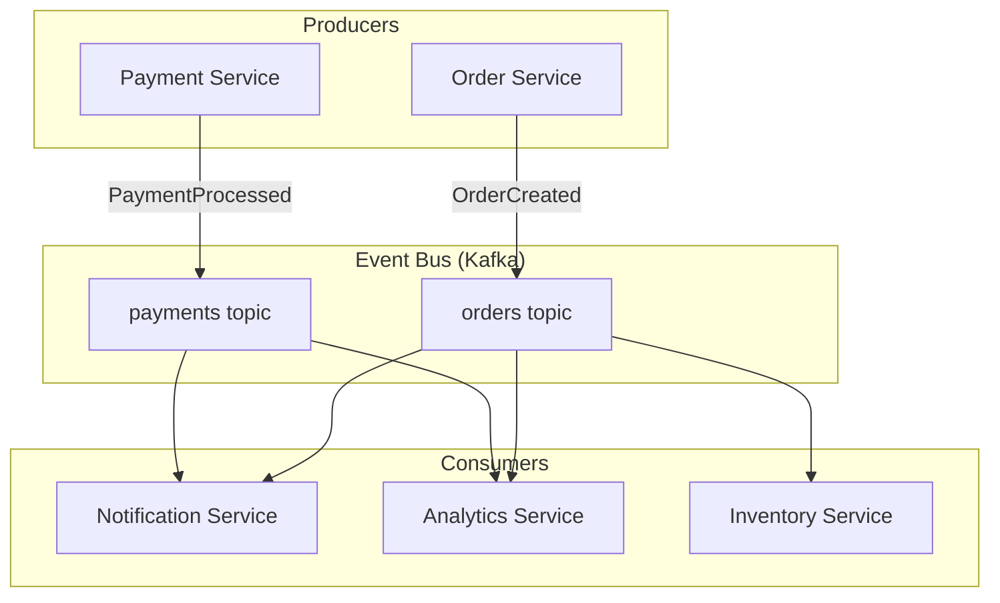

---

## Class Diagrams (Domain Model)

### Domain Entities

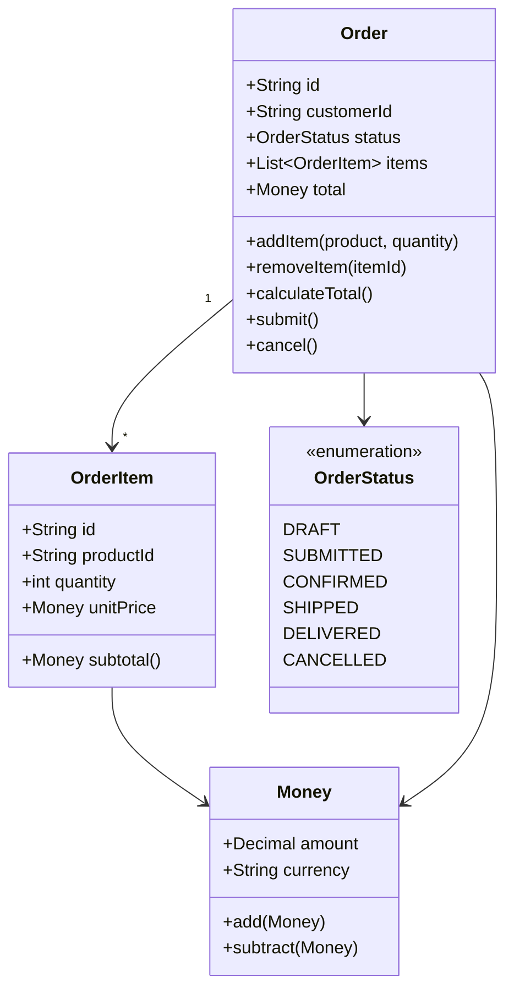

---

## Quick Copy Templates

### Minimal System Diagram
```
graph TB
    Client --> API --> DB[(Database)]
```

### Basic Layers
```
graph TB
    UI[Presentation] --> App[Application] --> Domain --> Infra[Infrastructure]
```

### Request/Response
```
sequenceDiagram
    Client->>Server: Request
    Server-->>Client: Response
```

### Simple State
```
stateDiagram-v2
    [*] --> State1
    State1 --> State2
    State2 --> [*]
```

### Basic ERD
```
erDiagram
    A ||--o{ B : has
    A { id PK }
    B { id PK, a_id FK }
```
