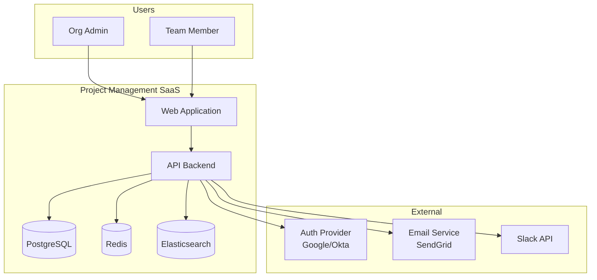
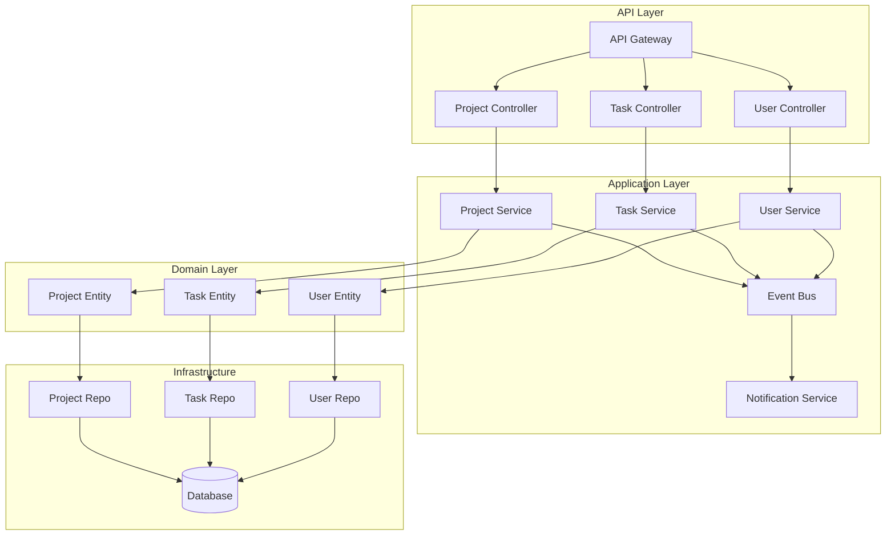
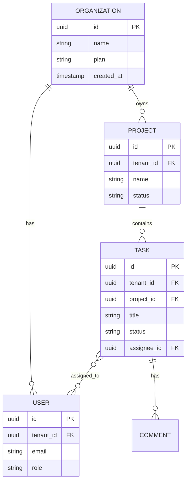
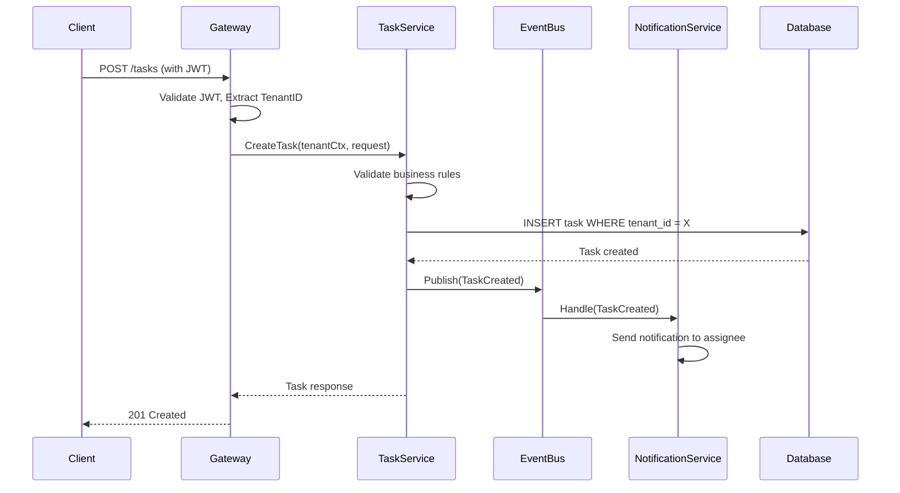

# Architecture Workflow Example

Complete example demonstrating the architecture review workflow.

## Request

> "Design a multi-tenant SaaS backend for a project management tool"

---

## Step 1: REQUIREMENTS

<requirements>

## Functional Requirements
1. **Multi-tenancy**: Each organization has isolated data
2. **Projects**: Create, update, delete, archive projects
3. **Tasks**: CRUD operations, assignments, due dates, status
4. **Users**: Invite, roles (Admin, Member, Viewer)
5. **Comments**: On tasks, with mentions
6. **Notifications**: Email + in-app for assignments, mentions
7. **Search**: Full-text search across projects and tasks
8. **Audit**: Log all changes for compliance

## Non-Functional Requirements (NFRs)

| Category | Requirement | Target |
|----------|-------------|--------|
| Performance | API response time | < 100ms p95 |
| Scale | Organizations | 10,000 |
| Scale | Users per org | 500 |
| Scale | Concurrent users | 50,000 |
| Availability | Uptime | 99.95% |
| Security | Authentication | OAuth2 + SAML (SSO) |
| Security | Data isolation | Tenant data never mixed |
| Data | Backup | Daily, 30-day retention |
| Compliance | Standards | SOC2, GDPR |

## Constraints
- Tech stack: Go backend (team expertise)
- Timeline: MVP in 3 months
- Team: 4 backend developers
- Budget: Cloud-native, moderate cost
- Integration: Slack, GitHub, Jira webhooks

## Out of Scope (MVP)
- Mobile apps (web-first)
- Real-time collaboration (future)
- Custom workflows (future)
- Self-hosted option (future)

</requirements>

---

## Step 2: HIGH-LEVEL DESIGN

<high_level_design>

## Architecture Style
**Modular Monolith** with event-driven internal communication.

### Rationale
- Team of 4 → Microservices overhead not justified
- Clear module boundaries enable future extraction
- Simpler operations for MVP timeline
- Event-driven allows loose coupling between modules

## Multi-Tenancy Strategy
**Shared Database, Shared Schema with Tenant ID**

```
Every table has: tenant_id (indexed, enforced)

Pros: Simple, cost-effective, easy backup
Cons: Careful query design, risk of data leak
Mitigation: Row-level security, middleware enforcement
```

## Layer Structure

```
┌─────────────────────────────────────────────────────────┐
│                    API Gateway                          │
│         (Auth, Rate Limit, Tenant Resolution)           │
├─────────────────────────────────────────────────────────┤
│                 HTTP Controllers                        │
│    (Request validation, Response formatting)            │
├─────────────────────────────────────────────────────────┤
│                 Application Layer                       │
│    ┌─────────┐ ┌─────────┐ ┌─────────┐ ┌─────────┐    │
│    │ Project │ │  Task   │ │  User   │ │  Notif  │    │
│    │ Module  │ │ Module  │ │ Module  │ │ Module  │    │
│    └────┬────┘ └────┬────┘ └────┬────┘ └────┬────┘    │
│         │           │           │           │          │
│         └───────────┴───────────┴───────────┘          │
│                         │                              │
│                    Event Bus                           │
├─────────────────────────────────────────────────────────┤
│                   Domain Layer                          │
│         (Entities, Business Rules, Value Objects)       │
├─────────────────────────────────────────────────────────┤
│                Infrastructure Layer                     │
│    ┌─────────┐ ┌─────────┐ ┌─────────┐ ┌─────────┐    │
│    │   DB    │ │  Cache  │ │  Queue  │ │ Search  │    │
│    │ (Postgres)│ │ (Redis) │ │ (Redis) │ │(Elastic)│    │
│    └─────────┘ └─────────┘ └─────────┘ └─────────┘    │
└─────────────────────────────────────────────────────────┘
```

## Core Modules

| Module | Responsibility | Key Entities |
|--------|---------------|--------------|
| **Tenant** | Organization management, billing | Organization, Subscription |
| **User** | Authentication, authorization, profiles | User, Role, Permission |
| **Project** | Project lifecycle, settings | Project, ProjectMember |
| **Task** | Task management, assignments | Task, TaskAssignment, Comment |
| **Notification** | Alerts, emails, in-app | Notification, NotificationPreference |
| **Search** | Indexing, full-text search | SearchIndex |
| **Audit** | Change logging, compliance | AuditLog |

## Key Interfaces

```go
// Tenant context - passed through all operations
type TenantContext struct {
    TenantID string
    UserID   string
    Roles    []string
}

// Project Module Interface
type ProjectService interface {
    Create(ctx context.Context, tc TenantContext, req CreateProjectRequest) (*Project, error)
    Get(ctx context.Context, tc TenantContext, id string) (*Project, error)
    List(ctx context.Context, tc TenantContext, filter ProjectFilter) (*ProjectList, error)
    Update(ctx context.Context, tc TenantContext, id string, req UpdateProjectRequest) (*Project, error)
    Delete(ctx context.Context, tc TenantContext, id string) error
}

// Task Module Interface
type TaskService interface {
    Create(ctx context.Context, tc TenantContext, projectID string, req CreateTaskRequest) (*Task, error)
    Get(ctx context.Context, tc TenantContext, id string) (*Task, error)
    Update(ctx context.Context, tc TenantContext, id string, req UpdateTaskRequest) (*Task, error)
    Assign(ctx context.Context, tc TenantContext, id string, userID string) error
    AddComment(ctx context.Context, tc TenantContext, taskID string, comment string) (*Comment, error)
}

// Event Interface (internal communication)
type Event interface {
    Type() string
    TenantID() string
    Payload() interface{}
}

type EventBus interface {
    Publish(ctx context.Context, event Event) error
    Subscribe(eventType string, handler EventHandler) error
}
```

## Data Flow

```
[Client]
    → [API Gateway: Auth + Tenant Resolution]
    → [Controller: Validate + Route]
    → [Service: Business Logic]
    → [Repository: Data Access with TenantID]
    → [Database: Row-Level Security]

    [Service] → [EventBus] → [Subscribers]
                                ├→ [NotificationModule]
                                ├→ [SearchModule]
                                └→ [AuditModule]
```

</high_level_design>

---

## Step 3: DIAGRAM

<diagram>

## System Context (C4 Level 1)



## Module Architecture (C4 Level 2)



## Multi-Tenancy Data Model



## Request Flow Sequence



</diagram>

---

## Step 4: ALTERNATIVES

<alternatives>

## Option A: Shared Database, Shared Schema (Recommended)

### Description
All tenants share one database with `tenant_id` column on every table.

### Pros
- Simple to implement and maintain
- Cost-effective (one database)
- Easy cross-tenant analytics (if needed)
- Straightforward backup/restore

### Cons
- Query discipline required (always filter by tenant_id)
- Noisy neighbor risk (one tenant's load affects others)
- Single database as bottleneck
- Data leak risk if query misses tenant_id

### Mitigation
- Row-level security policies
- Middleware that enforces tenant_id
- Connection pooling per tenant (optional)

### Best For
- B2B SaaS with moderate tenant count
- Tenants with similar usage patterns
- Cost-conscious deployments

---

## Option B: Shared Database, Separate Schema

### Description
Each tenant gets their own database schema (e.g., `tenant_123.projects`).

### Pros
- Better isolation than shared schema
- Easier per-tenant backup
- Can have tenant-specific customizations
- Clear data boundaries

### Cons
- Schema migration complexity (apply to all)
- Connection management overhead
- Harder cross-tenant queries
- More database objects to manage

### Best For
- Tenants needing customization
- Regulated industries
- Medium tenant count (< 1000)

---

## Option C: Separate Database per Tenant

### Description
Each tenant gets their own database instance.

### Pros
- Complete isolation
- Independent scaling
- No noisy neighbor
- Tenant can have own backup schedule

### Cons
- High operational cost
- Complex provisioning
- Resource underutilization
- Difficult to manage at scale

### Best For
- Enterprise customers
- Strict compliance requirements
- Tenants paying premium

---

## Comparison Matrix

| Criteria | Shared Schema | Separate Schema | Separate DB |
|----------|--------------|-----------------|-------------|
| Isolation | Low | Medium | High |
| Cost | Low | Medium | High |
| Complexity | Low | Medium | High |
| Scalability | Medium | Medium | High |
| Customization | Low | Medium | High |
| Maintenance | Easy | Medium | Hard |

</alternatives>

---

## Step 5: RECOMMENDATION

<recommended>

## Recommended Approach: Shared Database, Shared Schema

### Decision
Based on requirements, I recommend **Shared Database with Shared Schema** and **Row-Level Security**.

### Justification

| Factor | Analysis |
|--------|----------|
| Scale (10K orgs) | Shared schema handles this well |
| Team Size (4 devs) | Simpler model = faster development |
| Timeline (3 months) | No time for complex multi-DB setup |
| Cost | Cloud DB costs scale with data, not tenants |
| Isolation | RLS + middleware provides sufficient isolation |

### Key Design Decisions

1. **Row-Level Security (PostgreSQL)**
   ```sql
   -- Every query automatically filtered
   ALTER TABLE tasks ENABLE ROW LEVEL SECURITY;
   CREATE POLICY tenant_isolation ON tasks
       USING (tenant_id = current_setting('app.tenant_id')::uuid);
   ```

2. **Middleware Enforcement**
   ```go
   func TenantMiddleware(next http.Handler) http.Handler {
       return http.HandlerFunc(func(w http.ResponseWriter, r *http.Request) {
           tenantID := extractTenantFromJWT(r)
           if tenantID == "" {
               http.Error(w, "Unauthorized", 401)
               return
           }
           ctx := context.WithValue(r.Context(), "tenant_id", tenantID)
           next.ServeHTTP(w, r.WithContext(ctx))
       })
   }
   ```

3. **Repository Pattern with Tenant**
   ```go
   func (r *TaskRepository) Create(ctx context.Context, task *Task) error {
       tenantID := ctx.Value("tenant_id").(string)
       task.TenantID = tenantID  // Always set
       return r.db.Create(task)
   }
   ```

### Technology Choices

| Component | Choice | Rationale |
|-----------|--------|-----------|
| Language | Go 1.21 | Team expertise, performance |
| Database | PostgreSQL 15 | RLS support, JSON, mature |
| Cache | Redis 7 | Caching, pub/sub, queues |
| Search | Elasticsearch 8 | Full-text, scalable |
| Auth | Auth0 | SAML/OAuth, reduces dev time |
| Email | SendGrid | Reliable, good API |
| Queue | Redis Streams | Simple, already have Redis |

</recommended>

---

## Step 6: RISKS

<risks>

## Technical Risks

### Risk 1: Tenant Data Leak
- **Probability**: Low (with RLS)
- **Impact**: Critical
- **Mitigation**:
  - PostgreSQL Row-Level Security enabled
  - Middleware always sets tenant context
  - Integration tests verify isolation
  - Security audit before launch

### Risk 2: Database Performance at Scale
- **Probability**: Medium
- **Impact**: High
- **Mitigation**:
  - Proper indexing (tenant_id + other columns)
  - Read replicas for read-heavy operations
  - Connection pooling (PgBouncer)
  - Query optimization and monitoring

### Risk 3: Search Index Scalability
- **Probability**: Medium
- **Impact**: Medium
- **Mitigation**:
  - Index per tenant (Elasticsearch alias)
  - Background indexing via events
  - Index lifecycle management

### Risk 4: Event Bus Reliability
- **Probability**: Low
- **Impact**: Medium
- **Mitigation**:
  - Redis Streams with consumer groups
  - Dead letter queue for failures
  - Idempotent handlers
  - Monitoring and alerting

## Operational Risks

### Risk 5: Deployment Complexity
- **Probability**: Low
- **Impact**: Medium
- **Mitigation**:
  - CI/CD pipeline from day 1
  - Database migrations separate from code
  - Feature flags for gradual rollout
  - Automated rollback procedures

## Risk Matrix

| Risk | Probability | Impact | Priority | Owner |
|------|-------------|--------|----------|-------|
| Data Leak | Low | Critical | P0 | Security |
| DB Performance | Medium | High | P1 | Backend |
| Search Scale | Medium | Medium | P2 | Backend |
| Event Reliability | Low | Medium | P3 | Backend |

</risks>

---

## Step 7: NEXT STEPS

<next_steps>

## Approval Checklist
- [ ] Architecture design reviewed by tech lead
- [ ] Multi-tenancy strategy approved
- [ ] Technology choices confirmed
- [ ] Risk mitigations accepted
- [ ] Timeline agreed

## Implementation Phases

### Phase 1: Foundation (Week 1-2)
- [ ] Project setup, CI/CD
- [ ] Database schema with RLS
- [ ] Authentication (Auth0 integration)
- [ ] Tenant middleware
- [ ] Core domain models

### Phase 2: Core Modules (Week 3-6)
- [ ] User module (invite, roles)
- [ ] Project module (CRUD)
- [ ] Task module (CRUD, assignments)
- [ ] Event bus setup
- [ ] Basic notifications

### Phase 3: Extended Features (Week 7-10)
- [ ] Comments and mentions
- [ ] Full-text search (Elasticsearch)
- [ ] Audit logging
- [ ] External integrations (Slack)

### Phase 4: Polish (Week 11-12)
- [ ] Performance optimization
- [ ] Security audit
- [ ] Monitoring and alerting
- [ ] Documentation
- [ ] Load testing

## Questions for Stakeholder
1. Does this architecture meet your requirements?
2. Any concerns about the multi-tenancy approach?
3. Are the technology choices acceptable?
4. Should we proceed with Phase 1?

</next_steps>
