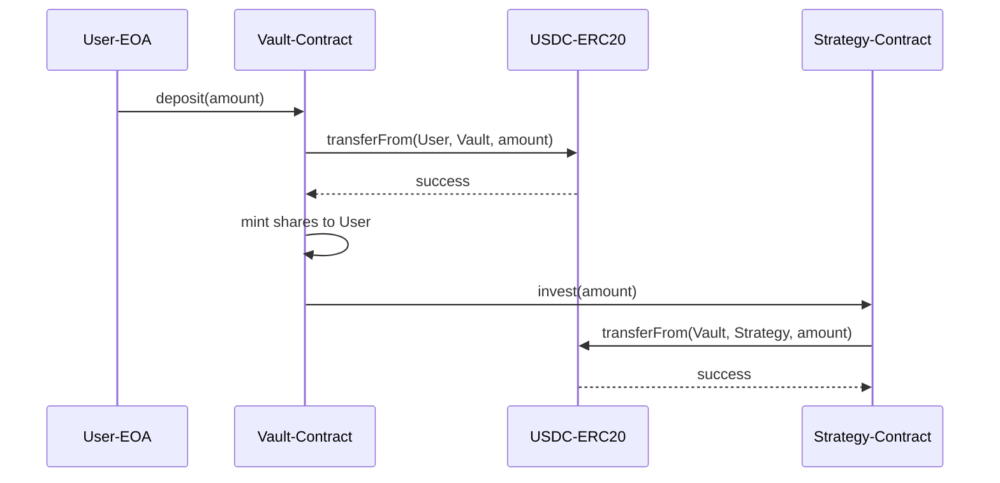

# solidity-fund-flow-analysis

Fund flow risk analysis for smart contract security audits. This is Step 3 of the audit workflow -- it produces a comprehensive fund flow risk document covering privileged account access, user fund paths, and per-function risk assessment.

## Gate Check (MANDATORY)

Before starting, verify prior steps are complete. **Do NOT proceed if any check fails.**

```bash
PROTOCOL="{protocol}"

# Steps 1-2 outputs must exist
ls ~/.solidity-analyzer/audits/$PROTOCOL/01-source-analysis.md || echo "BLOCKED: Step 1 not complete"
ls ~/.solidity-analyzer/audits/$PROTOCOL/02-interface-analysis.md || echo "BLOCKED: Step 2 (interface analysis) not complete"

# Verify Step 2 has no unresolved items
grep -riE "need.*verif|TBD|TODO|unknown|\?\s*\|" ~/.solidity-analyzer/audits/$PROTOCOL/02-interface-analysis.md && echo "BLOCKED: Step 2 has unverified items"
```

Step 2 provides the privileged address inventory, architecture diagram, and external call map that this skill depends on. Read `02-interface-analysis.md` before proceeding.

## Output

Write all results to: `~/.solidity-analyzer/audits/{protocol}/03-fund-flow-risk.md`

---

## Conventions (约定)

### Special Symbols (特殊符号含义)

| Symbol | Meaning |
|--------|---------|
| ✅ | Correct / Safe / Verified |
| ❎ | Incorrect / Risky / Unverified |

### Wallet Address Naming Convention (特殊含义的钱包地址命名规范)

Format: `{名字-}标签`

The label (标签) identifies the wallet type. Use one of:

| Label | Meaning |
|-------|---------|
| `EOA` | Externally Owned Account |
| `Contract` | Regular contract |
| `Proxy` | Proxy contract |
| `MultiSig` | Multi-signature wallet |
| `DAO` | DAO governance contract |
| `ERC20` | ERC-20 token contract |
| `ERC721` | ERC-721 NFT contract |
| `Factory` | Factory contract |

### Address Identification Table (地址识别表)

Include this table in the output document. Identify ALL addresses involved in fund flows.

| 名称 | 钱包地址 | 合约 | 代理 | 多签 | 描述 |
|------|----------|------|------|------|------|
| ZERO_ADDRESS | `0x0000...0000` | - | - | - | Zero address (burn target) |
| {ProtocolName}-MultiSig | `0x1234...5678` | ❎ | ❎ | ✅ | Protocol treasury multisig |
| {ProtocolName}-Contract | `0xabcd...ef01` | ✅ | ❎ | ❎ | Core protocol contract |
| {TokenName}-ERC20 | `0x2345...6789` | ✅ | ❎ | ❎ | Protocol governance token |
| {Name}-Proxy | `0x3456...7890` | ✅ | ✅ | ❎ | Upgradeable proxy for vault |
| Admin-EOA | `0x4567...8901` | ❎ | ❎ | ❎ | Admin externally owned account |

Verify every address on-chain with `cast call` or `cast code`. No unverified addresses allowed.

---

## Instructions

### 1. Fund Risk Overview (合约资金风险概述)

#### 1.1 CheckList

Evaluate each item and mark with ✅ or ❎:

```markdown
- [ ] 特权账号检查: 是否存在可单独操作资金的特权账号
- [ ] 合约是否可升级: 升级机制是否可被利用来篡改资金逻辑
- [ ] 是否可绕过白名单限制: 白名单/黑名单机制是否存在绕过路径
- [ ] 是否可转移资金: 特权账号是否可直接转移合约中的用户资金
- [ ] 是否可导致资金锁死: 是否存在操作使资金永久锁定在合约中
```

#### 1.2 Contract Overview Table (合约概览表)

Build this table for every in-scope contract:

| 合约 | 可升级性 | 升级/替换权限拥有者 | 可绕过白名单限制 | 可转移资金 | 可导致资金锁死 | 风险概述 |
|------|----------|---------------------|------------------|------------|----------------|----------|
| `ContractA` | ✅ UUPS | Admin-MultiSig | ❎ | ✅ `withdraw()` | ❎ | High: admin can drain via upgrade |
| `ContractB` | ❎ Immutable | N/A | ❎ | ❎ | ✅ no rescue function | Medium: locked funds on error |

#### 1.3 Privileged Account Overview Table (合约及其对应特权账号概览表)

Map every privileged role to its current holder and chain of authority:

| 合约 | 特权名 | 描述 | 当前对应钱包地址 | 可更改 | 谁有权设置该特权 | 最终掌权人 |
|------|--------|------|------------------|--------|------------------|------------|
| `Vault` | `owner` | Can pause, upgrade, set fees | Admin-MultiSig `0x1234...` | ✅ | `transferOwnership()` by current owner | Admin-MultiSig |
| `Vault` | `feeRecipient` | Receives protocol fees | Treasury-EOA `0x5678...` | ✅ | `setFeeRecipient()` by owner | Admin-MultiSig |
| `Token` | `minter` | Can mint new tokens | Vault-Contract `0xabcd...` | ❎ | Set at deploy, immutable | N/A |

Verify every address value on-chain:
```bash
cast call {contract} "owner()(address)" --rpc-url https://evm.web3gate.xyz/evm/{chainId}
```

### 2. Fund Flow Analysis (资金流分析)

Analyze each fund-moving action separately. An "action" is any user or admin operation that causes token/ETH movement (deposit, withdraw, claim, stake, liquidate, etc.).

For each action, produce all four subsections below.

#### 2.1 Action Interfaces ({Action} 相关接口)

List every function involved in the action:

```markdown
### Deposit 相关接口

- `Vault.deposit(uint256 amount) external`
- `Vault.depositETH() external payable`
- `Strategy.invest(uint256 amount) internal`
```

#### 2.2 Contract Fund Flow Analysis (合约资金流解析)

Write a text overview followed by the relevant Solidity interface snippet:

```markdown
#### 概述

用户调用 `Vault.deposit()` 将 ERC-20 代币存入 Vault 合约。Vault 将代币转入 Strategy 合约进行投资。
用户获得等额 shares 代币作为存款凭证。

#### 接口

​```solidity
interface IVault {
    /// @notice Deposit tokens into the vault
    /// @param amount Amount of tokens to deposit
    function deposit(uint256 amount) external;

    /// @notice Deposit ETH into the vault
    function depositETH() external payable;
}
​```
```

#### 2.3 Sequence Diagram (资金流序列图)

Draw a Mermaid sequence diagram showing the fund movement for the action:

````markdown

````

Use the address naming convention from the Conventions section for all participants.

#### 2.4 Risk Description (风险描述)

For each action, enumerate specific risks:

```markdown
#### 风险描述

1. **特权风险**: Strategy 合约地址由 owner 设置，恶意 owner 可将 Strategy 指向攻击合约，窃取所有存款
2. **资金锁死风险**: 若 Strategy 合约暂停或自毁，Vault 中记录的 shares 无法兑换，用户资金永久锁定
3. **重入风险**: `deposit()` 在 mint shares 前调用外部 `transferFrom()`，若 Token 含回调可重入
```

### 3. Repeat for All Actions

Repeat Section 2 for every fund-moving action discovered in the protocol. Common actions include:
- Deposit / Withdraw
- Stake / Unstake
- Claim rewards
- Liquidation
- Fee collection
- Emergency withdraw / Rescue
- Admin fund transfer

### 4. Final Verification

Before writing the output file, run self-checks:

```bash
# No unverified items
grep -riE "need.*verif|TBD|TODO|unknown|\?\s*\|" ~/.solidity-analyzer/audits/{protocol}/03-fund-flow-risk.md

# No unchecked boxes
grep -rn "\- \[ \]" ~/.solidity-analyzer/audits/{protocol}/03-fund-flow-risk.md
```

Fix all findings before marking Step 3 as complete.

## Iron Rules

1. **Every address must be verified on-chain.** Use `cast call` to confirm current values of owner, admin, fee recipient, and all privileged roles. Never copy addresses from documentation or comments without verification.

2. **Every fund-moving function gets a sequence diagram.** No exceptions. If tokens or ETH move, draw the flow.

3. **Use the naming convention.** All addresses in diagrams and tables use the `{Name}-Label` format defined in Conventions.

4. **No placeholder values.** Every cell in every table must contain a verified value or explicit "N/A" with justification.

5. **Complete the CheckList honestly.** Mark ❎ for genuine risks -- do not whitewash findings.
