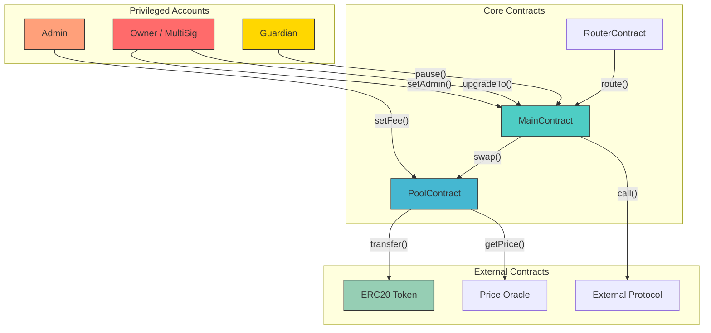
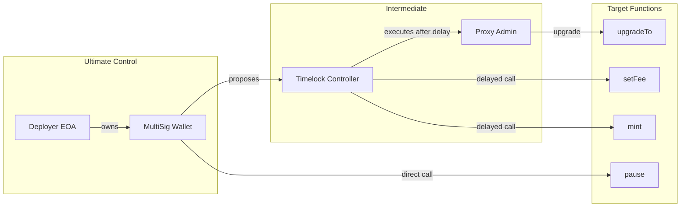
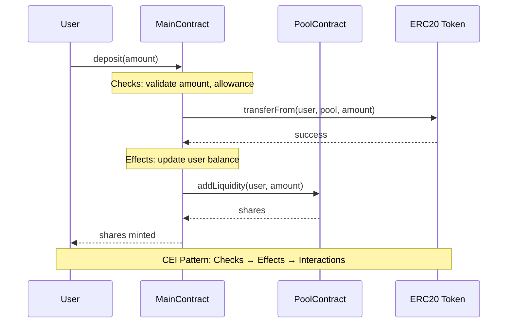

# solidity-interface-analysis

Perform Step 2 of a solidity audit: smart contract interface and architecture analysis. All outputs go to `~/.solidity-analyzer/audits/{protocol}/`.

## When to use

Activate this skill when the user requests interface analysis, architecture analysis, privileged address analysis, external call risk assessment, or permission chain tracing for a smart contract or protocol.

## Prerequisites

The `etherscan-contract-fetcher` skill must have already fetched the contract source code. Verify that `~/.solidity-analyzer/audits/{protocol}/` exists and contains fetched source files before proceeding. If sources are missing, instruct the user to run the fetcher first.

## Key Analysis Requirements

Perform ALL of the following analyses:

1. **Contract Architecture Diagram (Mermaid)** -- Map all contracts in the protocol and their relationships (inheritance, ownership, delegation, calls). Render as a Mermaid `graph TB` diagram with subgraphs for core contracts, privileged accounts, and external contracts.

2. **Privileged Address Analysis** -- Identify every privileged role (owner, admin, operator, guardian, pauser, minter, etc.). Document what each role can do, whether it is protected by MultiSig or Timelock, and assess risk.

3. **Call Flow Security Analysis** -- Trace critical user flows (deposit, withdraw, swap, liquidate, etc.) as Mermaid sequence diagrams. Verify CEI (Checks-Effects-Interactions) pattern compliance.

4. **External Call Risk Assessment** -- Catalog every external call (`call`, `staticcall`, `delegatecall`). Assess reentrancy risk, return value handling, gas limits, callback risk, oracle manipulation, and flash loan attack vectors.

## Instructions

1. Read all fetched source files from `~/.solidity-analyzer/audits/{protocol}/contracts/`.
2. Identify the main logic contract, auxiliary contracts, and token contracts.
3. Map inheritance hierarchies and inter-contract call relationships.
4. Identify all privileged roles by searching for `onlyOwner`, `onlyRole`, `require(msg.sender ==`, access control modifiers, and similar patterns.
5. Trace permission chains from ultimate control (deployer/multisig) through intermediate contracts to target functions.
6. Catalog all external calls and assess their risk.
7. Analyze critical user flows for security patterns.
8. Verify on-chain state using `cast` commands.
9. Write the complete analysis to `~/.solidity-analyzer/audits/{protocol}/02-interface-analysis.md` using the template below.

## Verification Commands

Use `cast` to verify on-chain state during analysis:

```bash
# Check contract owner
cast call ADDRESS "owner()(address)" --rpc-url https://evm.web3gate.xyz/evm/{chainId}

# Verify contract has code deployed
cast code ADDRESS --rpc-url https://evm.web3gate.xyz/evm/{chainId}
```

Replace `ADDRESS` with the actual contract address and `{chainId}` with the target chain ID (e.g., 1 for Ethereum mainnet).

## Output Template

Write the following to `~/.solidity-analyzer/audits/{protocol}/02-interface-analysis.md`:

````markdown
# {Protocol} 接口与架构分析

## 1. 合约基本信息

### 1.1 简介

{Protocol description: what it does, what chain it runs on, key mechanisms.}

### 1.2 主逻辑合约名称及地址

- **{ContractName}**: [{address}](https://etherscan.io/address/{address})

### 1.3 辅助合约名称及地址

| Contract | Address | Description |
|----------|---------|-------------|
| {Name} | [{address}](https://etherscan.io/address/{address}) | {What it does} |

### 1.4 代币合约名称及地址

| Token | Symbol | Address | Description |
|-------|--------|---------|-------------|
| {TokenName} | {SYM} | [{address}](https://etherscan.io/address/{address}) | {Role in protocol} |

---

## 2. 合约架构分析

### 2.1 合约关系图



### 2.2 特权地址列表

| 地址 | 类型 | 角色 | 权限描述 | Timelock | 安全分析 |
|------|------|------|----------|----------|----------|
| {address} | EOA/MultiSig/Contract | Owner | {Full admin: upgrade, pause, set parameters} | {Yes 48h / No} | {Risk assessment} |
| {address} | EOA/MultiSig/Contract | Admin | {Limited: set fees, whitelist} | {Yes 24h / No} | {Risk assessment} |

### 2.3 特权安全检查项

- [ ] **MultiSig保护**: 关键特权地址是否为多签钱包
- [ ] **Timelock保护**: 高风险操作是否有时间锁延迟
- [ ] **权限分离**: Owner/Admin/Operator权限是否分离
- [ ] **紧急暂停**: 是否存在紧急暂停机制 (pause/unpause)
- [ ] **权限可撤销**: 特权角色是否可被撤销或转移
- [ ] **零地址检查**: 权限转移时是否检查零地址

### 2.4 权限链追踪



---

## 3. 外部调用安全分析

### 3.1 外部调用清单

| 调用合约 | 目标合约 | 调用函数 | 调用类型 | 风险等级 | 风险描述 |
|----------|----------|----------|----------|----------|----------|
| Pool | Oracle | getPrice() | staticcall | Medium | Oracle manipulation possible |
| Main | Token | transfer() | call | Low | Standard ERC20, checked return |
| Proxy | Implementation | fallback() | delegatecall | High | Full storage access delegation |

### 3.2 调用安全检查项

- [ ] **Reentrancy防护**: 外部调用是否遵循 CEI 模式或使用 ReentrancyGuard
- [ ] **返回值检查**: 外部调用返回值是否被正确检查 (尤其 ERC20 transfer)
- [ ] **Gas限制**: 外部调用是否设置了合理的 gas 限制
- [ ] **回调风险**: 是否存在通过回调函数的攻击向量
- [ ] **Oracle操纵**: 价格预言机是否可被闪电贷操纵
- [ ] **闪电贷风险**: 关键操作是否可被闪电贷利用

---

## 4. 流程分析

### 4.1 核心流程



---

## 5. 合约调用安全总结

### 5.1 发现的问题

| 编号 | 严重程度 | 位置 | 问题描述 | 建议 |
|------|----------|------|----------|------|
| I-01 | {Critical/High/Medium/Low/Info} | {Contract.sol#L123} | {Description of the issue} | {Recommended fix} |
| I-02 | {Critical/High/Medium/Low/Info} | {Contract.sol#L456} | {Description of the issue} | {Recommended fix} |
````

Replace all `{placeholder}` values with actual findings from the analysis. Remove example rows and fill in real data. Check or uncheck each security checklist item based on actual findings.
